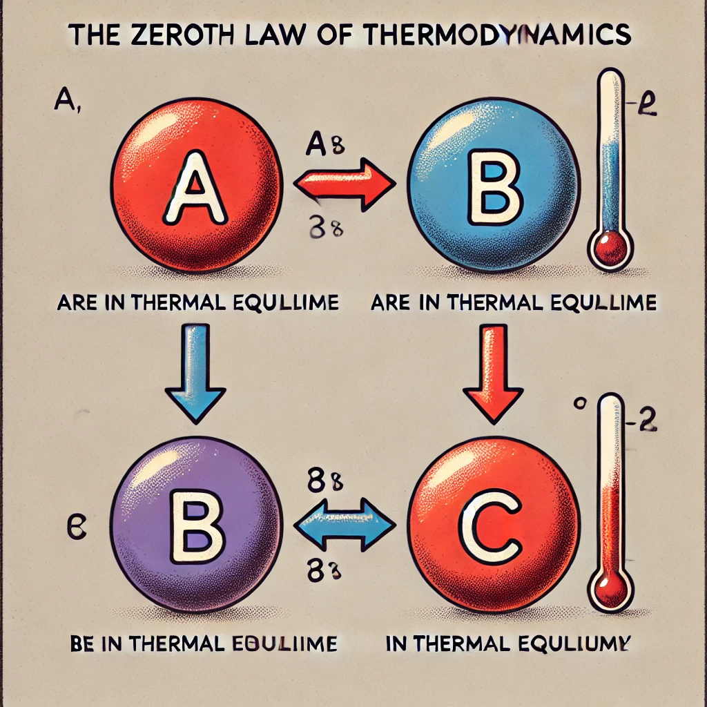
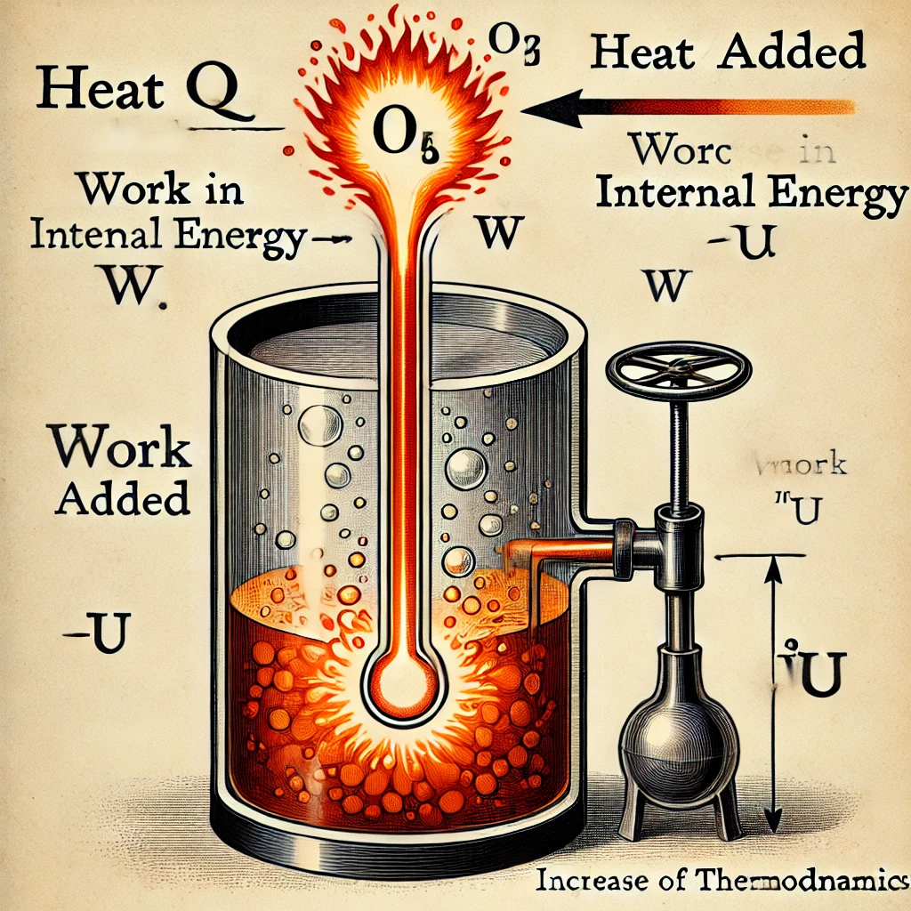

# **Zeroth Law of Thermodynamics**!

### What is the Zeroth Law of Thermodynamics?
The **Zeroth Law of Thermodynamics** is a fundamental principle of thermal equilibrium. It helps define the concept of temperature.

- **Statement of the Zeroth Law**: 
   *If two systems, A and B, are each in thermal equilibrium with a third system, C, then systems A and B are in thermal equilibrium with each other.*

#### What does this mean?
- Imagine we have three objects: A, B, and C.
- If A and C are at the same temperature (in thermal equilibrium), and B and C are also at the same temperature, then A and B must be at the same temperature, even if they’re not in direct contact.

This law is important because it allows us to use a thermometer (system C) to measure the temperature of other systems (A and B). It is the basis for defining **temperature** as a measurable quantity.

### Temperature
- **Temperature** is a measure of how hot or cold something is. More scientifically, it's related to the average kinetic energy (movement energy) of the particles in a substance.
- The Zeroth Law makes temperature a meaningful concept because it allows us to compare temperatures of different systems without them directly interacting.

### Illustration
Imagine two cups of water: one warm and one cold. You place a thermometer in each cup. According to the Zeroth Law, if the thermometer shows the same temperature in both cups, we can say the cups of water are at the same temperature.

I'll provide a visual to help you understand this better!

Here is a simple visual representation of the **Zeroth Law of Thermodynamics**. It shows how if two systems (A and B) are in equilibrium with a third system (C), they must also be in equilibrium with each other, meaning they have the same temperature.

Let me know if you'd like to explore any part of this further!

# **First Law of Thermodynamics**!

### What is the First Law of Thermodynamics?
The **First Law of Thermodynamics** is essentially a statement of the **conservation of energy**. It states that:

- **Energy cannot be created or destroyed, only transferred or transformed.**

In terms of thermodynamics, it can be written as:

\[ \Delta U = Q - W \]

Where:
- \( \Delta U \) = Change in internal energy of the system
- \( Q \) = Heat added to the system
- \( W \) = Work done by the system

This law explains how energy is conserved in a system and helps understand how energy flows in heat engines, refrigerators, and other devices.

### What does this mean?
- **Internal Energy (U):** This is the energy related to the microscopic motion and interaction of particles in a system.
- **Heat (Q):** Heat is energy transferred to or from a system due to a temperature difference.
- **Work (W):** Work is energy transferred when a system exerts a force over a distance, like in moving pistons.

#### Key Points
1. If you add heat (\( Q \)) to a system, part of it increases the internal energy (\( \Delta U \)) and part of it may be used to do work (\( W \)).
2. If the system does work (like moving a piston), its internal energy decreases unless additional heat is provided.
3. Conversely, if the system has work done on it, like compressing a gas, its internal energy increases.

### Example
Imagine a gas in a cylinder with a piston. If you heat the gas, its temperature rises, and the gas expands, pushing the piston up. In this case:
- The heat you added increases the internal energy of the gas.
- Part of this energy is also used to push the piston, doing work on it.

### Energy Conservation
- The First Law is essentially about **energy conservation**: the total energy in the system (internal energy, heat, and work) is conserved. No energy is lost; it's just transformed.

### Illustration
To help visualize, imagine a gas cylinder with a moving piston where heat is added, causing the piston to move, demonstrating work done and the increase in internal energy. Let me provide a visual!

Here is an illustration of the **First Law of Thermodynamics** showing how heat added to a gas causes the piston to move, with labels indicating the heat, work, and internal energy. This helps visualize how energy is conserved in such a system.

Let me know if you'd like to discuss any part in more detail!

# Internal Energy in Thermodynamics

**Internal energy** is the total energy contained within a system. In thermodynamics, this energy is due to the microscopic movements and interactions of the particles (atoms or molecules) in the system.

### What does Internal Energy include?
Internal energy (\(U\)) is made up of two main components:
1. **Kinetic energy**: Due to the motion (vibration, rotation, and translation) of the particles.
2. **Potential energy**: Due to the interactions (forces) between particles, like the attractive or repulsive forces between molecules.

### How does internal energy change?
The internal energy of a system can change in two main ways:
- **Adding heat** (\(Q\)): When heat is added to a system, the energy of the particles increases, raising their kinetic energy and, in some cases, their potential energy.
- **Doing work** (\(W\)): Work is done on or by the system, leading to changes in the energy. For example, compressing a gas (doing work on it) increases its internal energy.

The **First Law of Thermodynamics** links internal energy to heat and work:
\[ \Delta U = Q - W \]
Where:
- \( \Delta U \) is the change in internal energy.
- \( Q \) is the heat added to the system.
- \( W \) is the work done by the system.

### Microscopic Understanding
On a microscopic level, internal energy reflects the random motion of particles:
- For a **gas**, this mainly comes from the kinetic energy of the gas molecules moving around.
- In **solids and liquids**, there is also potential energy from the bonds between atoms and molecules.

### Internal Energy and Temperature
- **For ideal gases**, the internal energy is directly related to temperature: as temperature increases, the internal energy increases because the particles move faster.
- However, in real gases and other substances, the relationship can also involve changes in potential energy due to interactions between particles.

### Example
Consider a gas in a container. If you heat the gas:
- The molecules move faster (higher kinetic energy), and the internal energy increases.
- The temperature rises, and if the gas does work (like moving a piston), some of the energy goes into that work.

Would you like to dive deeper into how internal energy behaves in different systems, like gases or solids?

# Conversion of Heat into Work

In thermodynamics, **heat** can be converted into **work** through specific processes. This is a fundamental concept in engines and other systems where energy transformation occurs. 

The process of converting heat into work is governed by the **First Law of Thermodynamics**, which states:

\[
\Delta U = Q - W
\]

Where:
- \( \Delta U \) = change in internal energy
- \( Q \) = heat added to the system
- \( W \) = work done by the system

In simpler terms, the heat energy provided to a system can either:
1. Increase the system's internal energy.
2. Be converted into work (like moving a piston or driving a turbine).

### How Heat is Converted into Work
#### 1. **Heat Engines**
A heat engine is a device that converts heat into mechanical work. This process typically involves a **working substance**, such as a gas, that expands or contracts as heat is added or removed.

#### Example: The Ideal Gas in a Cylinder with a Piston
1. **Add heat to the gas**: Heat (\( Q \)) is added to a gas in a cylinder, causing the gas particles to move faster, increasing their kinetic energy.
2. **Gas expansion**: As the particles move faster, they collide with the walls of the container, causing the gas to expand. If the cylinder has a piston, the gas expansion pushes the piston upward.
3. **Work is done**: The movement of the piston means that work (\( W \)) is done by the gas on the surroundings.

In this process, the heat energy is partially converted into work. The rest may increase the internal energy of the gas, raising its temperature.

#### 2. **Carnot Cycle**
The **Carnot cycle** is a theoretical model that represents the most efficient way to convert heat into work. It consists of four stages:
1. **Isothermal Expansion**: Heat is added to a gas at a constant temperature, and the gas expands, doing work on a piston.
2. **Adiabatic Expansion**: The gas continues to expand without any heat exchange, and the gas cools.
3. **Isothermal Compression**: The gas is compressed at a lower temperature, and heat is released to the surroundings.
4. **Adiabatic Compression**: The gas is further compressed without heat exchange, increasing its temperature.

The Carnot cycle shows that even in the most efficient cycle, not all heat is converted into work. Some heat is always lost to the environment.

### Second Law of Thermodynamics
The **Second Law of Thermodynamics** states that not all heat can be converted into work in any cyclic process. Some energy will always remain as heat, especially when heat flows from a hotter system to a colder one. This is why no real engine is 100% efficient.

### Example of Heat Conversion: Steam Engine
In a **steam engine**:
- Water is heated to form steam.
- The steam expands, pushing a piston or turbine.
- This motion represents work, which can be used to power machines.

Some heat is lost in the process, which is why the engine isn’t fully efficient.

### Key Points
- Heat can be converted into work, but not all of it will be converted.
- The conversion happens in systems like engines where heat causes expansion, and the expansion does work (e.g., moving pistons).
- The efficiency of converting heat into work is limited by the **Second Law of Thermodynamics**.

Would you like to see a diagram of a heat engine or explore specific examples?

# Thermodynamic Processes

Thermodynamic processes describe how a system changes from one state to another, often involving exchanges of heat, work, or changes in internal energy. These processes occur under specific conditions, and each type has unique characteristics. The main thermodynamic processes are:

### 1. **Isothermal Process (Constant Temperature)**
- In an **isothermal process**, the temperature of the system remains constant (\( \Delta T = 0 \)).
- As the system is compressed or expanded, heat is either absorbed or released to maintain the constant temperature.
  
  **Example**: A gas expanding slowly in a cylinder while maintaining contact with a heat reservoir.

- **First Law**: 
  \[
  Q = W \quad (\text{since} \ \Delta U = 0)
  \]
  - The heat added to the system is equal to the work done by the system because the internal energy remains constant.

### 2. **Adiabatic Process (No Heat Exchange)**
- In an **adiabatic process**, no heat is transferred in or out of the system (\( Q = 0 \)).
- All the work done by the system changes its internal energy, leading to a change in temperature.

  **Example**: Rapid compression of a gas in a piston without time for heat to flow in or out.

- **First Law**:
  \[
  \Delta U = -W
  \]
  - Any work done on or by the system directly changes the internal energy.

### 3. **Isobaric Process (Constant Pressure)**
- In an **isobaric process**, the pressure of the system remains constant (\( \Delta P = 0 \)), but the volume can change.
- As heat is added, the system expands, and work is done.

  **Example**: Heating gas in a cylinder with a movable piston that allows the pressure to stay constant.

- **First Law**:
  \[
  Q = \Delta U + W
  \]
  - Heat added to the system changes both the internal energy and does work by expanding the volume.

### 4. **Isochoric Process (Constant Volume)**
- In an **isochoric process**, the volume remains constant (\( \Delta V = 0 \)), meaning no work is done (\( W = 0 \)).
- Any heat added changes only the internal energy and temperature.

  **Example**: Heating gas in a sealed, rigid container.

- **First Law**:
  \[
  Q = \Delta U
  \]
  - The heat added is fully converted into internal energy.

### 5. **Cyclic Process**
- In a **cyclic process**, the system undergoes a series of changes but eventually returns to its initial state.
- Since the internal energy depends only on the state, \( \Delta U = 0 \) for the entire cycle.

  **Example**: A steam engine operating in cycles (Carnot cycle).

- **First Law**:
  \[
  Q = W
  \]
  - The total heat added to the system is converted into work over the cycle.

### 6. **Reversible and Irreversible Processes**
- **Reversible processes** are idealized processes where the system can return to its initial state with no net changes to the system or surroundings.
- **Irreversible processes** involve factors like friction, turbulence, or rapid changes, and cannot be exactly reversed.

The **First Law of Thermodynamics**, also known as the **law of energy conservation**, states that energy cannot be created or destroyed, only transferred or converted from one form to another. The law is expressed as:

\[
\Delta U = Q - W
\]

Where:
- \( \Delta U \) = change in internal energy of a system
- \( Q \) = heat added to the system
- \( W \) = work done by the system

# **applications of the First Law of Thermodynamics**:

### 1. **Heat Engines**
A **heat engine** converts heat energy into mechanical work by operating in a thermodynamic cycle. In each cycle, some heat energy is transformed into work, and the rest is expelled to a cooler reservoir. According to the First Law:
- Heat input \( Q_H \) is partly converted to work \( W \), and the remainder is rejected as heat \( Q_C \).
  
Application:
- Steam engines, internal combustion engines, and jet engines rely on the First Law for energy conversion.

### 2. **Refrigerators and Heat Pumps**
Both **refrigerators** and **heat pumps** operate by transferring heat from a cooler area to a warmer one, which is the reverse of natural heat flow. The First Law governs the relationship between heat extracted, work input, and heat released:
- A refrigerator extracts heat (\( Q_C \)) from the inside and releases it (\( Q_H \)) outside with the help of work done by the compressor.

Application:
- Cooling systems, air conditioners, and household refrigerators work based on the First Law, converting electrical energy into work to move heat against its natural gradient.

### 3. **Biological Systems**
In living organisms, the First Law applies to the energy conversion of chemical reactions. Food energy (chemical energy) is metabolized, providing heat and allowing organisms to perform work like movement or growth:
- The calories from food intake are converted into internal energy and work for bodily functions.
  
Application:
- The human body converts the chemical energy from food into heat (to maintain body temperature) and mechanical work (muscle movement).

### 4. **Chemical Reactions**
In chemistry, reactions either release or absorb energy in the form of heat (exothermic or endothermic reactions). The First Law governs how energy is conserved in these reactions:
- In an **exothermic reaction**, energy is released into the surroundings (e.g., combustion).
- In an **endothermic reaction**, energy is absorbed from the surroundings (e.g., photosynthesis).

### 5. **Boilers and Turbines**
In power plants, **boilers** use the First Law to convert heat energy from fuel combustion into steam, which is then used to do work on turbine blades, generating electricity.
- The First Law explains how heat added to the steam increases the internal energy, doing work on turbines.

### 6. **Batteries and Fuel Cells**
In electrochemical cells (like **batteries** or **fuel cells**), chemical energy is converted into electrical energy and heat. The First Law explains the energy transformations involved:
- When a battery discharges, chemical energy is transformed into electrical energy for powering devices.

### 7. **Gas Compression and Expansion**
The First Law applies when gases are compressed or expanded, such as in a **piston-cylinder system**. When a gas is compressed, work is done on the gas, increasing its internal energy. Conversely, during expansion, the gas does work on its surroundings, losing internal energy.
  
Application:
- The First Law explains the behavior of gases in engines, air compressors, and hydraulic systems.

### 8. **Heating and Cooling Systems**
The First Law helps explain how systems like radiators, boilers, and air heaters convert energy into heat to maintain desired temperatures in buildings or devices. Heat input is used to increase internal energy and temperature.

These are just a few examples, but the First Law of Thermodynamics applies universally in every energy exchange system. Would you like more details on any specific application?

# ***general relation between \( C_P \) and \( C_V \)*** (specific heat at constant pressure and specific heat at constant volume, respectively) is an important concept in thermodynamics. These specific heats describe how much heat is required to raise the temperature of a gas by one degree, either at constant pressure (\( C_P \)) or constant volume (\( C_V \)).

### 1. **Definition of \( C_P \) and \( C_V \)**
- **\( C_V \)**: The amount of heat required to raise the temperature of a gas by 1 degree Celsius while keeping the volume constant.
  \[
  C_V = \left( \frac{\partial Q}{\partial T} \right)_V = \left( \frac{\partial U}{\partial T} \right)_V
  \]
  Since the volume is constant, no work is done, and all the heat goes into changing the internal energy of the gas.

- **\( C_P \)**: The amount of heat required to raise the temperature of a gas by 1 degree Celsius while keeping the pressure constant.
  \[
  C_P = \left( \frac{\partial Q}{\partial T} \right)_P = \left( \frac{\partial U}{\partial T} + P\frac{\partial V}{\partial T} \right)_P
  \]
  At constant pressure, the gas expands as it is heated, so part of the heat goes into doing work on the surroundings as the gas expands.

### 2. **Relationship Between \( C_P \) and \( C_V \)**
The relationship between \( C_P \) and \( C_V \) for an ideal gas is derived using the First Law of Thermodynamics and the ideal gas law. The relationship is given by the formula:

\[
C_P = C_V + R
\]

Where:
- \( R \) is the **ideal gas constant**, which has a value of \( 8.314 \, \text{J/mol K} \).
- The difference arises because, at constant pressure, the gas must do work to expand, so more heat is required compared to constant volume.

### 3. **Derivation Using the First Law of Thermodynamics**
From the First Law:
\[
\Delta Q = \Delta U + P \Delta V
\]

For an ideal gas:
- At **constant volume**: \( \Delta V = 0 \), so all heat goes into changing the internal energy. Hence, \( C_V \) only affects the internal energy.
  
- At **constant pressure**: Heat must not only change the internal energy but also do work to expand the gas. Hence, \( C_P \) accounts for both the increase in internal energy and the work done by the system.

For an ideal gas, the internal energy \( U \) depends only on temperature, so:
\[
\Delta U = nC_V \Delta T
\]

Using the ideal gas law \( PV = nRT \) to describe expansion, the relationship \( C_P = C_V + R \) comes from the fact that heat must also do work to expand the gas.

### 4. **Specific Heat Ratio (\( \gamma \))**
The ratio of specific heats is defined as:
\[
\gamma = \frac{C_P}{C_V}
\]

This ratio is important in many thermodynamic processes, especially in adiabatic processes where no heat is exchanged. For an ideal monoatomic gas:
\[
\gamma = \frac{5}{3}
\]
For a diatomic gas:
\[
\gamma = \frac{7}{5}
\]

### Key Points:
- \( C_P \) is always greater than \( C_V \) because at constant pressure, heat must do both work and raise the temperature.
- \( C_P - C_V = R \) is true for an ideal gas, which makes this relationship useful in calculations of heat and work in thermodynamic processes.

This relationship is fundamental for understanding heat transfer in gases and plays a critical role in processes like gas compression, expansion, and the design of engines.

Got it! Let’s dive into the concept of work done during isothermal and adiabatic processes. These are two important thermodynamic processes where the nature of heat exchange and work done are different.

### **1. Isothermal Process**

**Definition:**
An isothermal process occurs at a constant temperature. In such a process, the internal energy of an ideal gas remains constant since it depends only on temperature.

**Work Done:**

For an ideal gas undergoing an isothermal process, the work done \( W \) can be derived from the first law of thermodynamics and the ideal gas law. 

1. **Ideal Gas Law:**
   \[
   PV = nRT
   \]
   where \( P \) is the pressure, \( V \) is the volume, \( n \) is the number of moles, \( R \) is the gas constant, and \( T \) is the temperature (constant in this case).

2. **Expression for Work Done:**

   Work done \( W \) is given by the integral of \( PdV \) from the initial volume \( V_i \) to the final volume \( V_f \):
   \[
   W = \int_{V_i}^{V_f} P \, dV
   \]
   Substitute \( P \) from the ideal gas law:
   \[
   P = \frac{nRT}{V}
   \]
   Thus,
   \[
   W = \int_{V_i}^{V_f} \frac{nRT}{V} \, dV
   \]
   Solving this integral:
   \[
   W = nRT \ln \left(\frac{V_f}{V_i}\right)
   \]

### **2. Adiabatic Process**

**Definition:**
An adiabatic process is one where no heat is exchanged with the surroundings. The change in internal energy is entirely due to work done on or by the system.

**Work Done:**

For an ideal gas undergoing an adiabatic process, the relationship between pressure and volume is given by:

1. **Adiabatic Condition:**
   \[
   PV^\gamma = \text{constant}
   \]
   where \( \gamma \) (gamma) is the adiabatic index or heat capacity ratio \( \frac{C_p}{C_v} \).

2. **Expression for Work Done:**

   To find the work done \( W \), use the fact that the change in internal energy \( \Delta U \) for an ideal gas is:
   \[
   \Delta U = n C_v \Delta T
   \]
   The work done in an adiabatic process is equal to the change in internal energy:
   \[
   W = \Delta U
   \]

   Alternatively, using the relationship:
   \[
   W = \frac{P_i V_i - P_f V_f}{\gamma - 1}
   \]
   where \( P_i \) and \( V_i \) are the initial pressure and volume, and \( P_f \) and \( V_f \) are the final pressure and volume.

   Another useful formula when you know the initial and final temperatures:
   \[
   W = n C_v (T_i - T_f)
   \]
   where \( T_i \) and \( T_f \) are the initial and final temperatures.

### **Summary**

- **Isothermal Process:** 
  - Temperature is constant.
  - Work done \( W = nRT \ln \left(\frac{V_f}{V_i}\right) \).

- **Adiabatic Process:** 
  - No heat exchange.
  - Work done \( W = \frac{P_i V_i - P_f V_f}{\gamma - 1} \) or \( W = n C_v (T_i - T_f) \).

Feel free to ask if you need more details or examples on any of these processes!

Sure! Let's dive into both concepts:
